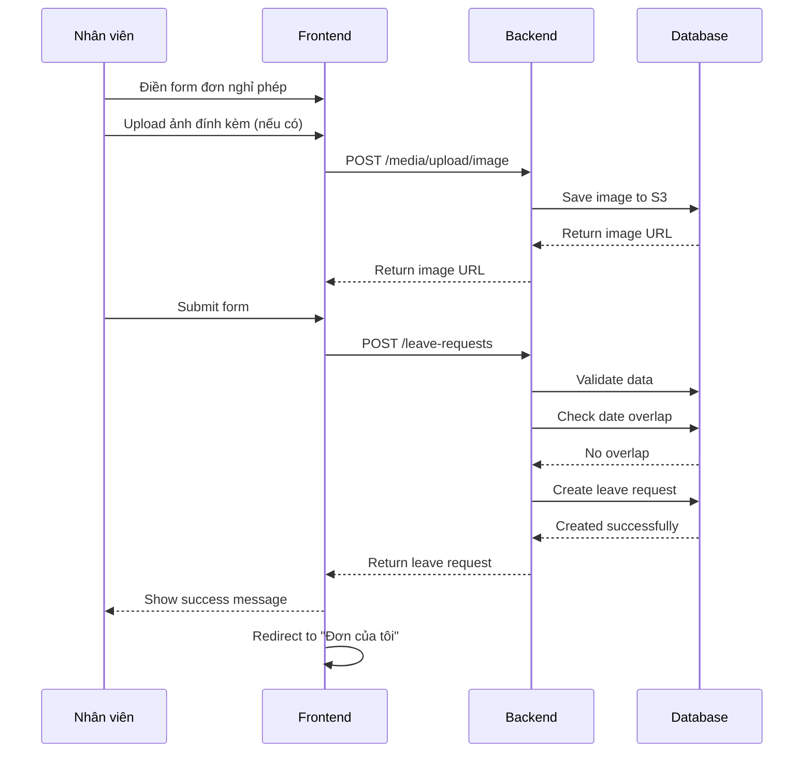
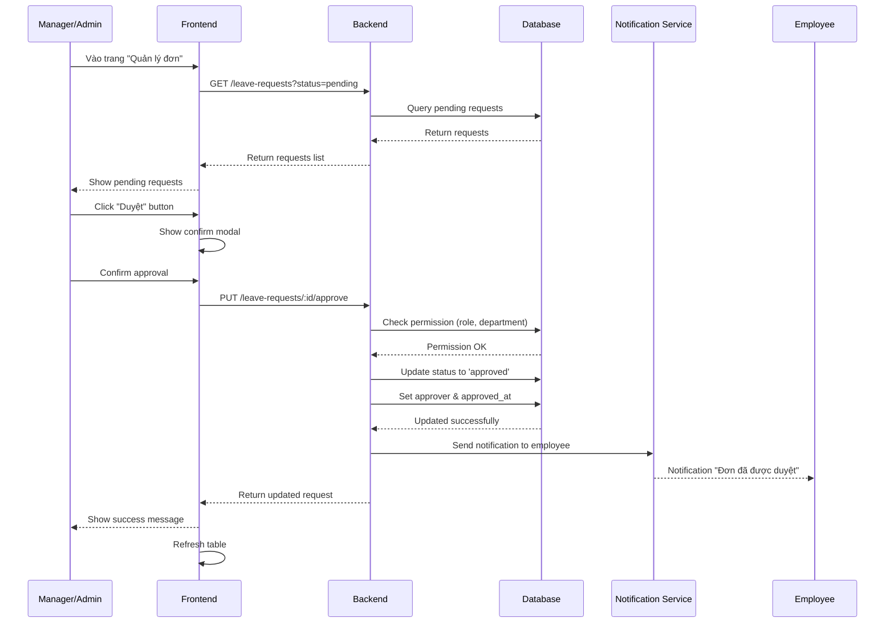
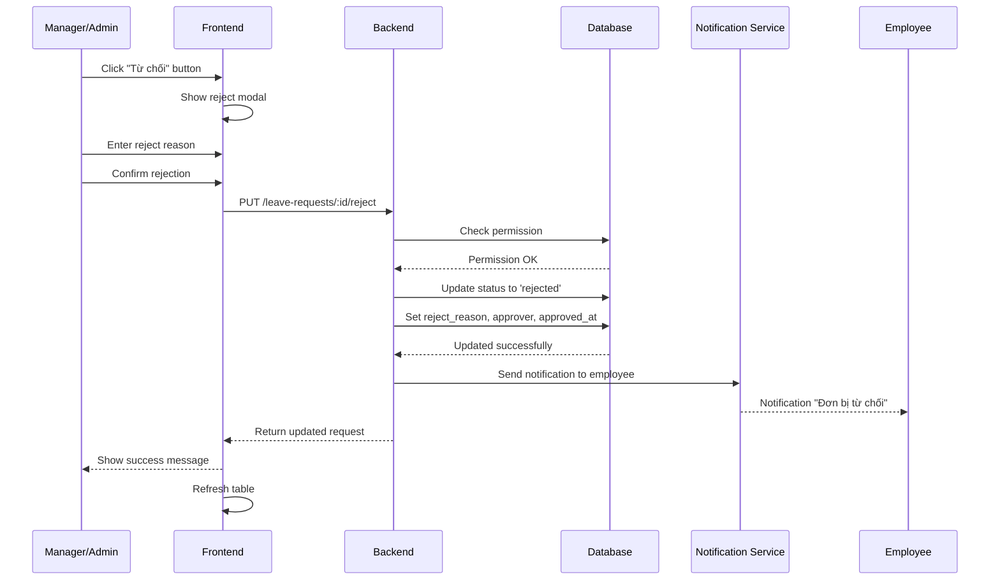

# TÀI LIỆU THIẾT KẾ TÍNH NĂNG: QUẢN LÝ ĐƠN XIN NGHỈ PHÉP

## 📋 MỤC LỤC

1. [Tổng quan tính năng](#1-tổng-quan-tính-năng)
2. [Yêu cầu nghiệp vụ](#2-yêu-cầu-nghiệp-vụ)
3. [Thiết kế Database](#3-thiết-kế-database)
4. [Thiết kế API Backend](#4-thiết-kế-api-backend)
5. [Thiết kế Frontend](#5-thiết-kế-frontend)
6. [Quy trình nghiệp vụ](#6-quy-trình-nghiệp-vụ)
7. [Phân quyền và Bảo mật](#7-phân-quyền-và-bảo-mật)
8. [Technical Stack](#8-technical-stack)
9. [Implementation Plan](#9-implementation-plan)

---

## 1. TỔNG QUAN TÍNH NĂNG

### 1.1. Mục đích
Xây dựng hệ thống quản lý đơn xin nghỉ phép cho phép nhân viên nộp đơn và người quản lý/admin phê duyệt đơn nghỉ phép.

### 1.2. Đối tượng sử dụng
- **Nhân viên**: Tạo và quản lý đơn nghỉ phép của mình
- **Leader/Manager**: Duyệt đơn nghỉ phép của nhân viên trong bộ phận
- **Admin**: Duyệt tất cả đơn nghỉ phép trong công ty

### 1.3. Tính năng chính
- ✅ Nhân viên nộp đơn xin nghỉ phép
- ✅ Leader/Admin duyệt hoặc từ chối đơn
- ✅ Xem lịch sử đơn nghỉ phép
- ✅ Thống kê số ngày nghỉ đã sử dụng
- ✅ Upload ảnh đính kèm (giấy xác nhận bệnh viện, v.v.)
- ✅ Thông báo trạng thái đơn

---

## 2. YÊU CẦU NGHIỆP VỤ

### 2.1. Thông tin đơn nghỉ phép
Mỗi đơn nghỉ phép cần có các thông tin sau:

| Trường | Kiểu dữ liệu | Bắt buộc | Mô tả |
|--------|-------------|----------|-------|
| Nhân viên nộp đơn | ObjectId (User) | ✅ | Người nộp đơn |
| Loại nghỉ phép | String/Enum | ✅ | Nghỉ phép năm, nghỉ ốm, nghỉ không lương, v.v. |
| Ngày bắt đầu | Date | ✅ | Ngày bắt đầu nghỉ |
| Ngày kết thúc | Date | ✅ | Ngày kết thúc nghỉ |
| Số ngày nghỉ | Number | ✅ | Tự động tính toán |
| Lý do nghỉ | String | ✅ | Lý do nghỉ phép |
| Ảnh đính kèm | Array[String] | ❌ | URLs của ảnh đính kèm |
| Trạng thái | String/Enum | ✅ | PENDING, APPROVED, REJECTED |
| Người duyệt | ObjectId (User) | ❌ | Người duyệt đơn |
| Ngày duyệt | Date | ❌ | Ngày duyệt |
| Lý do từ chối | String | ❌ | Lý do từ chối (nếu có) |

### 2.2. Quy tắc nghiệp vụ

#### 2.2.1. Quy tắc nộp đơn
- ✅ Nhân viên có thể nộp đơn nghỉ phép cho ngày trong tương lai
- ✅ Không thể nộp đơn cho ngày đã qua
- ✅ Ngày kết thúc phải >= ngày bắt đầu
- ✅ Không được trùng với đơn đã được duyệt
- ✅ Có thể upload tối đa 5 ảnh đính kèm

#### 2.2.2. Quy tắc duyệt đơn
- ✅ Leader chỉ duyệt đơn của nhân viên trong bộ phận mình
- ✅ Admin có thể duyệt tất cả đơn
- ✅ Một đơn cần được duyệt bởi Leader HOẶC Admin
- ✅ Sau khi duyệt, nhân viên nhận thông báo
- ✅ Có thể từ chối đơn với lý do cụ thể

#### 2.2.3. Loại nghỉ phép
```typescript
enum LeaveType {
  ANNUAL = 'annual',           // Nghỉ phép năm
  SICK = 'sick',               // Nghỉ ốm
  PERSONAL = 'personal',       // Nghỉ việc riêng
  UNPAID = 'unpaid',           // Nghỉ không lương
  MATERNITY = 'maternity',     // Nghỉ thai sản
  PATERNITY = 'paternity',     // Nghỉ chăm con
  BEREAVEMENT = 'bereavement', // Nghỉ tang lễ
  OTHER = 'other'              // Khác
}
```

#### 2.2.4. Trạng thái đơn
```typescript
enum LeaveStatus {
  PENDING = 'pending',     // Chờ duyệt
  APPROVED = 'approved',   // Đã duyệt
  REJECTED = 'rejected',   // Từ chối
  CANCELLED = 'cancelled'  // Đã hủy
}
```

---

## 3. THIẾT KẾ DATABASE

### 3.1. LeaveRequest Model

**File**: `SERVER/src/models/leave-request/leave-request.model.ts`

```typescript
import mongoose, { Schema, Document } from 'mongoose';

export interface ILeaveRequest extends Document {
  employee: mongoose.Types.ObjectId;           // Ref: User
  leave_type: string;                          // Loại nghỉ phép
  start_date: Date;                            // Ngày bắt đầu
  end_date: Date;                              // Ngày kết thúc
  days_count: number;                          // Số ngày nghỉ
  reason: string;                              // Lý do nghỉ
  attachments?: string[];                      // URLs ảnh đính kèm
  status: string;                              // Trạng thái
  approver?: mongoose.Types.ObjectId;          // Ref: User (người duyệt)
  approved_at?: Date;                          // Ngày duyệt
  reject_reason?: string;                      // Lý do từ chối
  created_at: Date;
  updated_at: Date;
}

const LeaveRequestSchema = new Schema<ILeaveRequest>({
  employee: {
    type: Schema.Types.ObjectId,
    ref: 'User',
    required: true,
    index: true
  },
  leave_type: {
    type: String,
    required: true,
    enum: ['annual', 'sick', 'personal', 'unpaid', 'maternity', 'paternity', 'bereavement', 'other'],
    index: true
  },
  start_date: {
    type: Date,
    required: true,
    index: true
  },
  end_date: {
    type: Date,
    required: true,
    index: true
  },
  days_count: {
    type: Number,
    required: true,
    min: 0.5  // Cho phép nghỉ nửa ngày
  },
  reason: {
    type: String,
    required: true,
    trim: true,
    maxlength: 500
  },
  attachments: {
    type: [String],
    default: []
  },
  status: {
    type: String,
    required: true,
    enum: ['pending', 'approved', 'rejected', 'cancelled'],
    default: 'pending',
    index: true
  },
  approver: {
    type: Schema.Types.ObjectId,
    ref: 'User'
  },
  approved_at: {
    type: Date
  },
  reject_reason: {
    type: String,
    trim: true,
    maxlength: 500
  },
  created_at: {
    type: Date,
    default: Date.now
  },
  updated_at: {
    type: Date,
    default: Date.now
  }
});

// Index compound cho query hiệu quả
LeaveRequestSchema.index({ employee: 1, status: 1 });
LeaveRequestSchema.index({ employee: 1, start_date: 1, end_date: 1 });
LeaveRequestSchema.index({ status: 1, created_at: -1 });

// Middleware: Update updated_at before save
LeaveRequestSchema.pre('save', function(next) {
  this.updated_at = new Date();
  next();
});

export const LeaveRequest = mongoose.model<ILeaveRequest>('LeaveRequest', LeaveRequestSchema);
```

### 3.2. Indexes
```javascript
// Tối ưu query performance
db.leaverequests.createIndex({ employee: 1, status: 1 });
db.leaverequests.createIndex({ employee: 1, start_date: 1, end_date: 1 });
db.leaverequests.createIndex({ status: 1, created_at: -1 });
db.leaverequests.createIndex({ leave_type: 1 });
```

---

## 4. THIẾT KẾ API BACKEND

### 4.1. Cấu trúc thư mục

```
SERVER/src/
├── constants/
│   └── leave-request/
│       ├── leave-request.enum.ts          # Enums
│       ├── leave-request.messages.ts      # Messages
│       └── leave-request.path.ts          # Route paths
├── controllers/
│   └── leave-request/
│       └── index.ts                       # LeaveRequestController
├── interfaces/
│   └── leave-request/
│       └── index.ts                       # Interfaces
├── middlewares/
│   └── leave-request/
│       └── leave-request.middleware.ts    # Validators
├── models/
│   └── leave-request/
│       └── leave-request.model.ts         # Model
├── repository/
│   └── leave-request/
│       └── index.ts                       # Repository
├── routes/
│   └── leave-request/
│       └── index.ts                       # Routes
└── services/
    └── leave-request/
        └── index.ts                       # Service
```

### 4.2. API Endpoints

#### Base Path: `/leave-requests`

| Method | Endpoint | Description | Roles |
|--------|----------|-------------|-------|
| POST | `/leave-requests` | Tạo đơn nghỉ phép mới | Employee, Manager, Admin |
| GET | `/leave-requests` | Lấy danh sách đơn nghỉ phép | Employee, Manager, Admin |
| GET | `/leave-requests/:id` | Lấy chi tiết đơn nghỉ phép | Employee, Manager, Admin |
| PUT | `/leave-requests/:id` | Cập nhật đơn nghỉ phép | Employee (chỉ đơn của mình, status=pending) |
| DELETE | `/leave-requests/:id` | Xóa/Hủy đơn nghỉ phép | Employee (chỉ đơn của mình, status=pending) |
| PUT | `/leave-requests/:id/approve` | Duyệt đơn nghỉ phép | Manager, Admin |
| PUT | `/leave-requests/:id/reject` | Từ chối đơn nghỉ phép | Manager, Admin |
| GET | `/leave-requests/stats/summary` | Thống kê tổng quan | Employee, Manager, Admin |
| GET | `/leave-requests/my-requests` | Lấy đơn của mình | Employee |
| GET | `/leave-requests/department/:deptId` | Lấy đơn của bộ phận | Manager, Admin |

### 4.3. API Specifications

#### 4.3.1. POST /leave-requests - Tạo đơn mới

**Request Body:**
```typescript
{
  leave_type: string;      // 'annual' | 'sick' | 'personal' | 'unpaid' | ...
  start_date: string;      // ISO Date: '2025-01-20'
  end_date: string;        // ISO Date: '2025-01-22'
  reason: string;          // Lý do nghỉ
  attachments?: string[];  // URLs của ảnh đã upload
}
```

**Response:**
```typescript
{
  message: 'Tạo đơn xin nghỉ phép thành công',
  result: {
    _id: string,
    employee: {
      _id: string,
      name: string,
      email: string,
      department: {
        _id: string,
        name: string
      }
    },
    leave_type: string,
    start_date: string,
    end_date: string,
    days_count: number,
    reason: string,
    attachments: string[],
    status: 'pending',
    created_at: string,
    updated_at: string
  }
}
```

#### 4.3.2. GET /leave-requests - Lấy danh sách đơn

**Query Parameters:**
```typescript
{
  current?: string;        // Page number (default: 1)
  pageSize?: string;       // Items per page (default: 10)
  status?: string;         // 'pending' | 'approved' | 'rejected' | 'cancelled'
  leave_type?: string;     // 'annual' | 'sick' | ...
  start_date?: string;     // Filter from date
  end_date?: string;       // Filter to date
  employee?: string;       // Employee ID (for admin/manager)
  department?: string;     // Department ID (for admin)
  search?: string;         // Search by employee name
}
```

**Response:**
```typescript
{
  message: 'Lấy danh sách đơn nghỉ phép thành công',
  result: {
    data: LeaveRequest[],
    pagination: {
      current: number,
      pageSize: number,
      total: number,
      totalPages: number
    }
  }
}
```

#### 4.3.3. GET /leave-requests/:id - Chi tiết đơn

**Response:**
```typescript
{
  message: 'Lấy thông tin đơn nghỉ phép thành công',
  result: {
    _id: string,
    employee: {
      _id: string,
      name: string,
      email: string,
      phone: string,
      avatar: string,
      department: {
        _id: string,
        name: string,
        code: string
      }
    },
    leave_type: string,
    start_date: string,
    end_date: string,
    days_count: number,
    reason: string,
    attachments: string[],
    status: string,
    approver?: {
      _id: string,
      name: string,
      email: string
    },
    approved_at?: string,
    reject_reason?: string,
    created_at: string,
    updated_at: string
  }
}
```

#### 4.3.4. PUT /leave-requests/:id - Cập nhật đơn

**Request Body:** (Chỉ cho phép update khi status = pending)
```typescript
{
  leave_type?: string,
  start_date?: string,
  end_date?: string,
  reason?: string,
  attachments?: string[]
}
```

#### 4.3.5. PUT /leave-requests/:id/approve - Duyệt đơn

**Request Body:**
```typescript
{
  // Không cần body, user_id lấy từ token
}
```

**Response:**
```typescript
{
  message: 'Duyệt đơn nghỉ phép thành công',
  result: {
    // Updated leave request
  }
}
```

#### 4.3.6. PUT /leave-requests/:id/reject - Từ chối đơn

**Request Body:**
```typescript
{
  reject_reason: string  // Required
}
```

**Response:**
```typescript
{
  message: 'Từ chối đơn nghỉ phép thành công',
  result: {
    // Updated leave request
  }
}
```

#### 4.3.7. GET /leave-requests/stats/summary - Thống kê

**Query Parameters:**
```typescript
{
  year?: string;      // Default: current year
  employee?: string;  // Employee ID (optional for admin/manager)
}
```

**Response:**
```typescript
{
  message: 'Lấy thống kê thành công',
  result: {
    total_requests: number,
    pending_requests: number,
    approved_requests: number,
    rejected_requests: number,
    total_days_used: number,
    total_days_remaining: number,  // Nếu có quota
    by_leave_type: {
      annual: number,
      sick: number,
      personal: number,
      // ...
    }
  }
}
```

### 4.4. Service Layer

**File**: `SERVER/src/services/leave-request/index.ts`

```typescript
export class LeaveRequestService {
  // Tạo đơn nghỉ phép
  async createLeaveRequest(data: CreateLeaveRequestDTO, employeeId: string);

  // Lấy danh sách đơn nghỉ phép
  async getLeaveRequests(query: GetLeaveRequestsQuery, userId: string, userRoles: string[]);

  // Lấy chi tiết đơn
  async getLeaveRequestById(id: string, userId: string, userRoles: string[]);

  // Cập nhật đơn
  async updateLeaveRequest(id: string, data: UpdateLeaveRequestDTO, userId: string);

  // Xóa/Hủy đơn
  async deleteLeaveRequest(id: string, userId: string);

  // Duyệt đơn
  async approveLeaveRequest(id: string, approverId: string, userRoles: string[], userDepartment?: string);

  // Từ chối đơn
  async rejectLeaveRequest(id: string, rejectReason: string, approverId: string, userRoles: string[], userDepartment?: string);

  // Thống kê
  async getLeaveStatsSummary(year: number, employeeId?: string);

  // Helper: Check overlap
  async checkDateOverlap(employeeId: string, startDate: Date, endDate: Date, excludeId?: string): Promise<boolean>;

  // Helper: Calculate days
  calculateDaysCount(startDate: Date, endDate: Date): number;

  // Helper: Check permission to approve
  async canApproveRequest(leaveRequest: ILeaveRequest, approverId: string, roles: string[], department?: string): Promise<boolean>;
}
```

### 4.5. Repository Layer

**File**: `SERVER/src/repository/leave-request/index.ts`

```typescript
export class LeaveRequestRepository {
  async createLeaveRequest(data: any): Promise<ILeaveRequest>;
  async findLeaveRequestById(id: string): Promise<ILeaveRequest | null>;
  async findLeaveRequestsByEmployee(employeeId: string, query: any): Promise<any>;
  async findLeaveRequestsByDepartment(departmentId: string, query: any): Promise<any>;
  async findAllLeaveRequests(query: any): Promise<any>;
  async updateLeaveRequest(id: string, data: any): Promise<ILeaveRequest | null>;
  async deleteLeaveRequest(id: string): Promise<boolean>;
  async checkOverlappingRequests(employeeId: string, startDate: Date, endDate: Date, excludeId?: string): Promise<boolean>;
  async getLeaveStats(employeeId: string, year: number): Promise<any>;
}
```

### 4.6. Middleware/Validators

**File**: `SERVER/src/middlewares/leave-request/leave-request.middleware.ts`

```typescript
import { checkSchema } from 'express-validator';
import { validate } from '../utils.middleware';

// Validator: Tạo đơn mới
export const createLeaveRequestValidator = validate(
  checkSchema({
    leave_type: {
      isIn: {
        options: [['annual', 'sick', 'personal', 'unpaid', 'maternity', 'paternity', 'bereavement', 'other']],
        errorMessage: 'Loại nghỉ phép không hợp lệ'
      }
    },
    start_date: {
      isISO8601: {
        errorMessage: 'Ngày bắt đầu không hợp lệ'
      },
      custom: {
        options: (value) => {
          const date = new Date(value);
          const today = new Date();
          today.setHours(0, 0, 0, 0);
          if (date < today) {
            throw new Error('Không thể nộp đơn cho ngày đã qua');
          }
          return true;
        }
      }
    },
    end_date: {
      isISO8601: {
        errorMessage: 'Ngày kết thúc không hợp lệ'
      },
      custom: {
        options: (value, { req }) => {
          const startDate = new Date(req.body.start_date);
          const endDate = new Date(value);
          if (endDate < startDate) {
            throw new Error('Ngày kết thúc phải sau hoặc bằng ngày bắt đầu');
          }
          return true;
        }
      }
    },
    reason: {
      isString: true,
      trim: true,
      isLength: {
        options: { min: 10, max: 500 },
        errorMessage: 'Lý do phải từ 10-500 ký tự'
      }
    },
    attachments: {
      optional: true,
      isArray: {
        errorMessage: 'Attachments phải là array'
      },
      custom: {
        options: (value) => {
          if (value && value.length > 5) {
            throw new Error('Tối đa 5 ảnh đính kèm');
          }
          return true;
        }
      }
    }
  }, ['body'])
);

// Validator: Cập nhật đơn
export const updateLeaveRequestValidator = validate(
  checkSchema({
    leave_type: { optional: true, isIn: { options: [['annual', 'sick', 'personal', 'unpaid', 'maternity', 'paternity', 'bereavement', 'other']] } },
    start_date: { optional: true, isISO8601: true },
    end_date: { optional: true, isISO8601: true },
    reason: { optional: true, isString: true, trim: true, isLength: { options: { min: 10, max: 500 } } },
    attachments: { optional: true, isArray: true }
  }, ['body'])
);

// Validator: Từ chối đơn
export const rejectLeaveRequestValidator = validate(
  checkSchema({
    reject_reason: {
      isString: true,
      trim: true,
      isLength: {
        options: { min: 10, max: 500 },
        errorMessage: 'Lý do từ chối phải từ 10-500 ký tự'
      }
    }
  }, ['body'])
);

// Validator: Query params
export const getLeaveRequestsQueryValidator = validate(
  checkSchema({
    current: { optional: true, isInt: { options: { min: 1 } } },
    pageSize: { optional: true, isInt: { options: { min: 1, max: 100 } } },
    status: { optional: true, isIn: { options: [['pending', 'approved', 'rejected', 'cancelled']] } },
    leave_type: { optional: true, isIn: { options: [['annual', 'sick', 'personal', 'unpaid', 'maternity', 'paternity', 'bereavement', 'other']] } },
    start_date: { optional: true, isISO8601: true },
    end_date: { optional: true, isISO8601: true },
    employee: { optional: true, isMongoId: true },
    department: { optional: true, isMongoId: true },
    search: { optional: true, isString: true, trim: true }
  }, ['query'])
);
```

### 4.7. Routes

**File**: `SERVER/src/routes/leave-request/index.ts`

```typescript
import { Router } from 'express';
import { LeaveRequestController } from '../../controllers/leave-request';
import { accessTokenValidator } from '../../middlewares/user/user.middleware';
import { requireRoles, requirePermissions } from '../../middlewares/auth/authorization.middleware';
import {
  createLeaveRequestValidator,
  updateLeaveRequestValidator,
  rejectLeaveRequestValidator,
  getLeaveRequestsQueryValidator
} from '../../middlewares/leave-request/leave-request.middleware';
import { wrapRequestHandler } from '../../middlewares/utils.middleware';

const leaveRequestRouter = Router();

// Tạo đơn mới (tất cả user đã login)
leaveRequestRouter.post(
  '/',
  accessTokenValidator,
  createLeaveRequestValidator,
  wrapRequestHandler(LeaveRequestController.createLeaveRequest)
);

// Lấy danh sách đơn
leaveRequestRouter.get(
  '/',
  accessTokenValidator,
  getLeaveRequestsQueryValidator,
  wrapRequestHandler(LeaveRequestController.getLeaveRequests)
);

// Lấy đơn của mình
leaveRequestRouter.get(
  '/my-requests',
  accessTokenValidator,
  getLeaveRequestsQueryValidator,
  wrapRequestHandler(LeaveRequestController.getMyLeaveRequests)
);

// Lấy đơn của bộ phận (Manager/Admin)
leaveRequestRouter.get(
  '/department/:deptId',
  accessTokenValidator,
  requireRoles(['admin', 'manager']),
  getLeaveRequestsQueryValidator,
  wrapRequestHandler(LeaveRequestController.getDepartmentLeaveRequests)
);

// Thống kê
leaveRequestRouter.get(
  '/stats/summary',
  accessTokenValidator,
  wrapRequestHandler(LeaveRequestController.getLeaveStatsSummary)
);

// Chi tiết đơn
leaveRequestRouter.get(
  '/:id',
  accessTokenValidator,
  wrapRequestHandler(LeaveRequestController.getLeaveRequestById)
);

// Cập nhật đơn (chỉ đơn pending của mình)
leaveRequestRouter.put(
  '/:id',
  accessTokenValidator,
  updateLeaveRequestValidator,
  wrapRequestHandler(LeaveRequestController.updateLeaveRequest)
);

// Xóa/Hủy đơn (chỉ đơn pending của mình)
leaveRequestRouter.delete(
  '/:id',
  accessTokenValidator,
  wrapRequestHandler(LeaveRequestController.deleteLeaveRequest)
);

// Duyệt đơn (Manager/Admin)
leaveRequestRouter.put(
  '/:id/approve',
  accessTokenValidator,
  requireRoles(['admin', 'manager']),
  wrapRequestHandler(LeaveRequestController.approveLeaveRequest)
);

// Từ chối đơn (Manager/Admin)
leaveRequestRouter.put(
  '/:id/reject',
  accessTokenValidator,
  requireRoles(['admin', 'manager']),
  rejectLeaveRequestValidator,
  wrapRequestHandler(LeaveRequestController.rejectLeaveRequest)
);

export default leaveRequestRouter;
```

### 4.8. Controller

**File**: `SERVER/src/controllers/leave-request/index.ts`

```typescript
import { Request, Response } from 'express';
import { LeaveRequestService } from '../../services/leave-request';

export class LeaveRequestController {
  static async createLeaveRequest(req: Request, res: Response) {
    const employeeId = req.decoded_authorization.user_id;
    const result = await LeaveRequestService.createLeaveRequest(req.body, employeeId);

    return res.status(201).json({
      message: 'Tạo đơn xin nghỉ phép thành công',
      result
    });
  }

  static async getLeaveRequests(req: Request, res: Response) {
    const userId = req.decoded_authorization.user_id;
    const userRoles = req.decoded_authorization.roles;
    const result = await LeaveRequestService.getLeaveRequests(req.query, userId, userRoles);

    return res.json({
      message: 'Lấy danh sách đơn nghỉ phép thành công',
      result
    });
  }

  static async getMyLeaveRequests(req: Request, res: Response) {
    const userId = req.decoded_authorization.user_id;
    const result = await LeaveRequestService.getMyLeaveRequests(req.query, userId);

    return res.json({
      message: 'Lấy danh sách đơn của tôi thành công',
      result
    });
  }

  static async getDepartmentLeaveRequests(req: Request, res: Response) {
    const { deptId } = req.params;
    const result = await LeaveRequestService.getDepartmentLeaveRequests(req.query, deptId);

    return res.json({
      message: 'Lấy danh sách đơn của bộ phận thành công',
      result
    });
  }

  static async getLeaveRequestById(req: Request, res: Response) {
    const { id } = req.params;
    const userId = req.decoded_authorization.user_id;
    const userRoles = req.decoded_authorization.roles;
    const result = await LeaveRequestService.getLeaveRequestById(id, userId, userRoles);

    return res.json({
      message: 'Lấy thông tin đơn nghỉ phép thành công',
      result
    });
  }

  static async updateLeaveRequest(req: Request, res: Response) {
    const { id } = req.params;
    const userId = req.decoded_authorization.user_id;
    const result = await LeaveRequestService.updateLeaveRequest(id, req.body, userId);

    return res.json({
      message: 'Cập nhật đơn nghỉ phép thành công',
      result
    });
  }

  static async deleteLeaveRequest(req: Request, res: Response) {
    const { id } = req.params;
    const userId = req.decoded_authorization.user_id;
    await LeaveRequestService.deleteLeaveRequest(id, userId);

    return res.json({
      message: 'Xóa đơn nghỉ phép thành công'
    });
  }

  static async approveLeaveRequest(req: Request, res: Response) {
    const { id } = req.params;
    const approverId = req.decoded_authorization.user_id;
    const userRoles = req.decoded_authorization.roles;
    const userDepartment = req.decoded_authorization.department;

    const result = await LeaveRequestService.approveLeaveRequest(
      id,
      approverId,
      userRoles,
      userDepartment
    );

    return res.json({
      message: 'Duyệt đơn nghỉ phép thành công',
      result
    });
  }

  static async rejectLeaveRequest(req: Request, res: Response) {
    const { id } = req.params;
    const { reject_reason } = req.body;
    const approverId = req.decoded_authorization.user_id;
    const userRoles = req.decoded_authorization.roles;
    const userDepartment = req.decoded_authorization.department;

    const result = await LeaveRequestService.rejectLeaveRequest(
      id,
      reject_reason,
      approverId,
      userRoles,
      userDepartment
    );

    return res.json({
      message: 'Từ chối đơn nghỉ phép thành công',
      result
    });
  }

  static async getLeaveStatsSummary(req: Request, res: Response) {
    const year = parseInt(req.query.year as string) || new Date().getFullYear();
    const userId = req.decoded_authorization.user_id;
    const userRoles = req.decoded_authorization.roles;
    const employeeId = (req.query.employee as string) || userId;

    // Admin/Manager có thể xem stats của người khác
    const targetEmployeeId = userRoles.includes('admin') || userRoles.includes('manager')
      ? employeeId
      : userId;

    const result = await LeaveRequestService.getLeaveStatsSummary(year, targetEmployeeId);

    return res.json({
      message: 'Lấy thống kê thành công',
      result
    });
  }
}
```

### 4.9. Constants

**File**: `SERVER/src/constants/leave-request/leave-request.enum.ts`

```typescript
export enum LeaveType {
  ANNUAL = 'annual',
  SICK = 'sick',
  PERSONAL = 'personal',
  UNPAID = 'unpaid',
  MATERNITY = 'maternity',
  PATERNITY = 'paternity',
  BEREAVEMENT = 'bereavement',
  OTHER = 'other'
}

export enum LeaveStatus {
  PENDING = 'pending',
  APPROVED = 'approved',
  REJECTED = 'rejected',
  CANCELLED = 'cancelled'
}

export const LEAVE_TYPE_LABELS: Record<LeaveType, string> = {
  [LeaveType.ANNUAL]: 'Nghỉ phép năm',
  [LeaveType.SICK]: 'Nghỉ ốm',
  [LeaveType.PERSONAL]: 'Nghỉ việc riêng',
  [LeaveType.UNPAID]: 'Nghỉ không lương',
  [LeaveType.MATERNITY]: 'Nghỉ thai sản',
  [LeaveType.PATERNITY]: 'Nghỉ chăm con',
  [LeaveType.BEREAVEMENT]: 'Nghỉ tang lễ',
  [LeaveType.OTHER]: 'Khác'
};

export const LEAVE_STATUS_LABELS: Record<LeaveStatus, string> = {
  [LeaveStatus.PENDING]: 'Chờ duyệt',
  [LeaveStatus.APPROVED]: 'Đã duyệt',
  [LeaveStatus.REJECTED]: 'Từ chối',
  [LeaveStatus.CANCELLED]: 'Đã hủy'
};
```

**File**: `SERVER/src/constants/leave-request/leave-request.messages.ts`

```typescript
export const LEAVE_REQUEST_MESSAGES = {
  CREATE_SUCCESS: 'Tạo đơn xin nghỉ phép thành công',
  UPDATE_SUCCESS: 'Cập nhật đơn nghỉ phép thành công',
  DELETE_SUCCESS: 'Xóa đơn nghỉ phép thành công',
  APPROVE_SUCCESS: 'Duyệt đơn nghỉ phép thành công',
  REJECT_SUCCESS: 'Từ chối đơn nghỉ phép thành công',

  NOT_FOUND: 'Không tìm thấy đơn nghỉ phép',
  UNAUTHORIZED: 'Bạn không có quyền thực hiện thao tác này',
  INVALID_STATUS: 'Trạng thái đơn không hợp lệ',
  ALREADY_PROCESSED: 'Đơn đã được xử lý',
  DATE_OVERLAP: 'Khoảng thời gian nghỉ bị trùng với đơn đã được duyệt',
  INVALID_DATE_RANGE: 'Khoảng thời gian không hợp lệ',
  PAST_DATE_NOT_ALLOWED: 'Không thể nộp đơn cho ngày đã qua',
  CANNOT_APPROVE_OWN_REQUEST: 'Không thể duyệt đơn của chính mình',
  DEPARTMENT_MISMATCH: 'Chỉ có thể duyệt đơn của nhân viên trong bộ phận'
};
```

---

## 5. THIẾT KẾ FRONTEND

### 5.1. Cấu trúc thư mục

```
CLIENT/src/
├── api/
│   └── leave-request/
│       └── index.ts                        # API calls
├── components/
│   └── leave-request/
│       ├── leave-request-form.tsx          # Form tạo/sửa đơn
│       ├── leave-request-detail.tsx        # Chi tiết đơn
│       ├── leave-request-status-tag.tsx    # Tag trạng thái
│       └── leave-request-approve-modal.tsx # Modal duyệt/từ chối
├── constants/
│   └── leave-request.ts                    # Constants
├── enum/
│   └── leave-request.enum.ts               # Enums
├── interface/
│   └── leave-request.interface.ts          # TypeScript interfaces
├── pages/
│   └── leave-request/
│       ├── my-requests/
│       │   └── index.tsx                   # Trang "Đơn của tôi"
│       ├── manage-requests/
│       │   └── index.tsx                   # Trang "Quản lý đơn" (Manager/Admin)
│       ├── create-request/
│       │   └── index.tsx                   # Trang "Tạo đơn mới"
│       └── request-calendar/
│           └── index.tsx                   # Lịch nghỉ phép (optional)
└── store/
    └── leave-request.ts                    # Zustand store (optional)
```

### 5.2. TypeScript Interfaces

**File**: `CLIENT/src/interface/leave-request.interface.ts`

```typescript
export interface LeaveRequest {
  _id: string;
  employee: {
    _id: string;
    name: string;
    email: string;
    phone?: string;
    avatar?: string;
    department?: {
      _id: string;
      name: string;
      code?: string;
    };
  };
  leave_type: string;
  start_date: string;
  end_date: string;
  days_count: number;
  reason: string;
  attachments?: string[];
  status: 'pending' | 'approved' | 'rejected' | 'cancelled';
  approver?: {
    _id: string;
    name: string;
    email: string;
  };
  approved_at?: string;
  reject_reason?: string;
  created_at: string;
  updated_at: string;
}

export interface CreateLeaveRequestDTO {
  leave_type: string;
  start_date: string;
  end_date: string;
  reason: string;
  attachments?: string[];
}

export interface UpdateLeaveRequestDTO {
  leave_type?: string;
  start_date?: string;
  end_date?: string;
  reason?: string;
  attachments?: string[];
}

export interface LeaveRequestQuery {
  current?: number;
  pageSize?: number;
  status?: string;
  leave_type?: string;
  start_date?: string;
  end_date?: string;
  employee?: string;
  department?: string;
  search?: string;
}

export interface LeaveRequestStats {
  total_requests: number;
  pending_requests: number;
  approved_requests: number;
  rejected_requests: number;
  total_days_used: number;
  total_days_remaining?: number;
  by_leave_type: Record<string, number>;
}
```

### 5.3. Enums & Constants

**File**: `CLIENT/src/enum/leave-request.enum.ts`

```typescript
export enum LeaveType {
  ANNUAL = 'annual',
  SICK = 'sick',
  PERSONAL = 'personal',
  UNPAID = 'unpaid',
  MATERNITY = 'maternity',
  PATERNITY = 'paternity',
  BEREAVEMENT = 'bereavement',
  OTHER = 'other'
}

export enum LeaveStatus {
  PENDING = 'pending',
  APPROVED = 'approved',
  REJECTED = 'rejected',
  CANCELLED = 'cancelled'
}
```

**File**: `CLIENT/src/constants/leave-request.ts`

```typescript
export const LEAVE_TYPE_OPTIONS = [
  { label: 'Nghỉ phép năm', value: 'annual' },
  { label: 'Nghỉ ốm', value: 'sick' },
  { label: 'Nghỉ việc riêng', value: 'personal' },
  { label: 'Nghỉ không lương', value: 'unpaid' },
  { label: 'Nghỉ thai sản', value: 'maternity' },
  { label: 'Nghỉ chăm con', value: 'paternity' },
  { label: 'Nghỉ tang lễ', value: 'bereavement' },
  { label: 'Khác', value: 'other' }
];

export const LEAVE_STATUS_OPTIONS = [
  { label: 'Chờ duyệt', value: 'pending' },
  { label: 'Đã duyệt', value: 'approved' },
  { label: 'Từ chối', value: 'rejected' },
  { label: 'Đã hủy', value: 'cancelled' }
];

export const LEAVE_STATUS_COLORS: Record<string, string> = {
  pending: 'warning',
  approved: 'success',
  rejected: 'error',
  cancelled: 'default'
};
```

### 5.4. API Client

**File**: `CLIENT/src/api/leave-request/index.ts`

```typescript
import request from '@/utils/request';
import type {
  LeaveRequest,
  CreateLeaveRequestDTO,
  UpdateLeaveRequestDTO,
  LeaveRequestQuery,
  LeaveRequestStats
} from '@/interface/leave-request.interface';

export const leaveRequestApi = {
  // Tạo đơn mới
  createLeaveRequest: (data: CreateLeaveRequestDTO) => {
    return request.post('/leave-requests', { json: data }).json<{
      message: string;
      result: LeaveRequest;
    }>();
  },

  // Lấy danh sách đơn
  getLeaveRequests: (params: LeaveRequestQuery) => {
    return request.get('/leave-requests', { searchParams: params }).json<{
      message: string;
      result: {
        data: LeaveRequest[];
        pagination: {
          current: number;
          pageSize: number;
          total: number;
          totalPages: number;
        };
      };
    }>();
  },

  // Lấy đơn của tôi
  getMyLeaveRequests: (params: LeaveRequestQuery) => {
    return request.get('/leave-requests/my-requests', { searchParams: params }).json<{
      message: string;
      result: {
        data: LeaveRequest[];
        pagination: any;
      };
    }>();
  },

  // Lấy đơn của bộ phận
  getDepartmentLeaveRequests: (deptId: string, params: LeaveRequestQuery) => {
    return request.get(`/leave-requests/department/${deptId}`, { searchParams: params }).json<{
      message: string;
      result: {
        data: LeaveRequest[];
        pagination: any;
      };
    }>();
  },

  // Lấy chi tiết đơn
  getLeaveRequestById: (id: string) => {
    return request.get(`/leave-requests/${id}`).json<{
      message: string;
      result: LeaveRequest;
    }>();
  },

  // Cập nhật đơn
  updateLeaveRequest: (id: string, data: UpdateLeaveRequestDTO) => {
    return request.put(`/leave-requests/${id}`, { json: data }).json<{
      message: string;
      result: LeaveRequest;
    }>();
  },

  // Xóa đơn
  deleteLeaveRequest: (id: string) => {
    return request.delete(`/leave-requests/${id}`).json<{
      message: string;
    }>();
  },

  // Duyệt đơn
  approveLeaveRequest: (id: string) => {
    return request.put(`/leave-requests/${id}/approve`).json<{
      message: string;
      result: LeaveRequest;
    }>();
  },

  // Từ chối đơn
  rejectLeaveRequest: (id: string, reject_reason: string) => {
    return request.put(`/leave-requests/${id}/reject`, {
      json: { reject_reason }
    }).json<{
      message: string;
      result: LeaveRequest;
    }>();
  },

  // Thống kê
  getLeaveStatsSummary: (year?: number, employee?: string) => {
    return request.get('/leave-requests/stats/summary', {
      searchParams: { year, employee }
    }).json<{
      message: string;
      result: LeaveRequestStats;
    }>();
  }
};
```

### 5.5. Pages & Components

#### 5.5.1. Trang "Đơn của tôi" (My Requests)

**File**: `CLIENT/src/pages/leave-request/my-requests/index.tsx`

**Features:**
- Hiển thị danh sách đơn nghỉ phép của nhân viên
- Filter theo trạng thái, loại nghỉ phép, ngày
- Actions: Tạo mới, Xem chi tiết, Sửa (nếu pending), Xóa (nếu pending)
- Hiển thị thống kê: tổng số ngày đã nghỉ, đơn chờ duyệt, v.v.

**UI Components:**
```tsx
<Card>
  <StatisticsCards stats={statsData} />
  <FilterBar onFilter={handleFilter} />
  <ProTable
    columns={[
      { title: 'STT', dataIndex: 'index' },
      { title: 'Loại nghỉ', dataIndex: 'leave_type', render: (type) => LEAVE_TYPE_LABELS[type] },
      { title: 'Từ ngày', dataIndex: 'start_date', render: formatDate },
      { title: 'Đến ngày', dataIndex: 'end_date', render: formatDate },
      { title: 'Số ngày', dataIndex: 'days_count' },
      { title: 'Lý do', dataIndex: 'reason', ellipsis: true },
      { title: 'Trạng thái', dataIndex: 'status', render: (status) => <StatusTag status={status} /> },
      { title: 'Người duyệt', dataIndex: 'approver', render: (approver) => approver?.name || '-' },
      { title: 'Ngày tạo', dataIndex: 'created_at', render: formatDateTime },
      { title: 'Thao tác', dataIndex: 'actions', render: (_, record) => <Actions record={record} /> }
    ]}
    dataSource={leaveRequests}
    pagination={pagination}
  />
</Card>
```

#### 5.5.2. Trang "Quản lý đơn" (Manage Requests - Manager/Admin)

**File**: `CLIENT/src/pages/leave-request/manage-requests/index.tsx`

**Features:**
- Hiển thị danh sách đơn nghỉ phép cần duyệt
- Filter theo nhân viên, bộ phận, trạng thái, loại nghỉ phép
- Actions: Duyệt, Từ chối, Xem chi tiết
- Badge hiển thị số đơn chờ duyệt

**UI Components:**
```tsx
<Card>
  <Tabs
    items={[
      { key: 'pending', label: <Badge count={pendingCount}>Chờ duyệt</Badge>, children: <PendingTable /> },
      { key: 'approved', label: 'Đã duyệt', children: <ApprovedTable /> },
      { key: 'rejected', label: 'Từ chối', children: <RejectedTable /> },
      { key: 'all', label: 'Tất cả', children: <AllTable /> }
    ]}
  />
</Card>
```

#### 5.5.3. Form tạo/sửa đơn

**File**: `CLIENT/src/components/leave-request/leave-request-form.tsx`

**Fields:**
```tsx
<Form form={form} layout="vertical" onFinish={onSubmit}>
  <Form.Item
    label="Loại nghỉ phép"
    name="leave_type"
    rules={[{ required: true, message: 'Vui lòng chọn loại nghỉ phép' }]}
  >
    <Select options={LEAVE_TYPE_OPTIONS} placeholder="Chọn loại nghỉ phép" />
  </Form.Item>

  <Form.Item
    label="Thời gian nghỉ"
    name="date_range"
    rules={[{ required: true, message: 'Vui lòng chọn thời gian nghỉ' }]}
  >
    <RangePicker
      format="DD/MM/YYYY"
      disabledDate={(current) => current && current < dayjs().startOf('day')}
      onChange={calculateDays}
    />
  </Form.Item>

  <Form.Item label="Số ngày nghỉ">
    <Input value={daysCount} disabled />
  </Form.Item>

  <Form.Item
    label="Lý do nghỉ"
    name="reason"
    rules={[
      { required: true, message: 'Vui lòng nhập lý do nghỉ' },
      { min: 10, message: 'Lý do phải ít nhất 10 ký tự' },
      { max: 500, message: 'Lý do tối đa 500 ký tự' }
    ]}
  >
    <TextArea rows={4} placeholder="Nhập lý do nghỉ phép..." showCount maxLength={500} />
  </Form.Item>

  <Form.Item label="Ảnh đính kèm" name="attachments">
    <Upload
      listType="picture-card"
      fileList={fileList}
      onChange={handleUploadChange}
      beforeUpload={beforeUpload}
      maxCount={5}
      customRequest={customUpload}
    >
      {fileList.length < 5 && <UploadButton />}
    </Upload>
  </Form.Item>

  <Form.Item>
    <Space>
      <Button type="primary" htmlType="submit" loading={loading}>
        {isEdit ? 'Cập nhật' : 'Nộp đơn'}
      </Button>
      <Button onClick={onCancel}>Hủy</Button>
    </Space>
  </Form.Item>
</Form>
```

#### 5.5.4. Modal duyệt/từ chối

**File**: `CLIENT/src/components/leave-request/leave-request-approve-modal.tsx`

```tsx
<Modal
  title={type === 'approve' ? 'Duyệt đơn nghỉ phép' : 'Từ chối đơn nghỉ phép'}
  open={open}
  onOk={handleSubmit}
  onCancel={onCancel}
  confirmLoading={loading}
>
  <Descriptions column={1} bordered>
    <Descriptions.Item label="Nhân viên">{leaveRequest.employee.name}</Descriptions.Item>
    <Descriptions.Item label="Bộ phận">{leaveRequest.employee.department?.name}</Descriptions.Item>
    <Descriptions.Item label="Loại nghỉ">{LEAVE_TYPE_LABELS[leaveRequest.leave_type]}</Descriptions.Item>
    <Descriptions.Item label="Thời gian">
      {formatDate(leaveRequest.start_date)} - {formatDate(leaveRequest.end_date)}
    </Descriptions.Item>
    <Descriptions.Item label="Số ngày">{leaveRequest.days_count} ngày</Descriptions.Item>
    <Descriptions.Item label="Lý do">{leaveRequest.reason}</Descriptions.Item>
    {leaveRequest.attachments && leaveRequest.attachments.length > 0 && (
      <Descriptions.Item label="Ảnh đính kèm">
        <Image.PreviewGroup>
          {leaveRequest.attachments.map((url, index) => (
            <Image key={index} src={url} width={100} />
          ))}
        </Image.PreviewGroup>
      </Descriptions.Item>
    )}
  </Descriptions>

  {type === 'reject' && (
    <Form form={form} layout="vertical" style={{ marginTop: 16 }}>
      <Form.Item
        label="Lý do từ chối"
        name="reject_reason"
        rules={[
          { required: true, message: 'Vui lòng nhập lý do từ chối' },
          { min: 10, message: 'Lý do phải ít nhất 10 ký tự' }
        ]}
      >
        <TextArea rows={4} placeholder="Nhập lý do từ chối..." showCount maxLength={500} />
      </Form.Item>
    </Form>
  )}

  {type === 'approve' && (
    <Alert
      message="Xác nhận duyệt đơn"
      description="Bạn có chắc chắn muốn duyệt đơn nghỉ phép này không?"
      type="info"
      showIcon
      style={{ marginTop: 16 }}
    />
  )}
</Modal>
```

#### 5.5.5. Chi tiết đơn

**File**: `CLIENT/src/components/leave-request/leave-request-detail.tsx`

```tsx
<Drawer title="Chi tiết đơn nghỉ phép" width={600} open={open} onClose={onClose}>
  <Descriptions column={1} bordered>
    <Descriptions.Item label="Trạng thái">
      <StatusTag status={leaveRequest.status} />
    </Descriptions.Item>
    <Descriptions.Item label="Nhân viên">
      <Space>
        <Avatar src={leaveRequest.employee.avatar} />
        <div>
          <div>{leaveRequest.employee.name}</div>
          <div style={{ fontSize: 12, color: '#999' }}>{leaveRequest.employee.email}</div>
        </div>
      </Space>
    </Descriptions.Item>
    <Descriptions.Item label="Bộ phận">
      {leaveRequest.employee.department?.name || '-'}
    </Descriptions.Item>
    <Descriptions.Item label="Loại nghỉ phép">
      <Tag>{LEAVE_TYPE_LABELS[leaveRequest.leave_type]}</Tag>
    </Descriptions.Item>
    <Descriptions.Item label="Ngày bắt đầu">
      {formatDate(leaveRequest.start_date)}
    </Descriptions.Item>
    <Descriptions.Item label="Ngày kết thúc">
      {formatDate(leaveRequest.end_date)}
    </Descriptions.Item>
    <Descriptions.Item label="Số ngày nghỉ">
      <b>{leaveRequest.days_count} ngày</b>
    </Descriptions.Item>
    <Descriptions.Item label="Lý do nghỉ">
      {leaveRequest.reason}
    </Descriptions.Item>
    {leaveRequest.attachments && leaveRequest.attachments.length > 0 && (
      <Descriptions.Item label="Ảnh đính kèm">
        <Image.PreviewGroup>
          {leaveRequest.attachments.map((url, index) => (
            <Image key={index} src={url} width={100} style={{ marginRight: 8 }} />
          ))}
        </Image.PreviewGroup>
      </Descriptions.Item>
    )}
    {leaveRequest.status !== 'pending' && (
      <>
        <Descriptions.Item label="Người duyệt">
          {leaveRequest.approver?.name || '-'}
        </Descriptions.Item>
        <Descriptions.Item label="Ngày duyệt">
          {leaveRequest.approved_at ? formatDateTime(leaveRequest.approved_at) : '-'}
        </Descriptions.Item>
      </>
    )}
    {leaveRequest.status === 'rejected' && leaveRequest.reject_reason && (
      <Descriptions.Item label="Lý do từ chối">
        <Alert message={leaveRequest.reject_reason} type="error" />
      </Descriptions.Item>
    )}
    <Descriptions.Item label="Ngày tạo">
      {formatDateTime(leaveRequest.created_at)}
    </Descriptions.Item>
    <Descriptions.Item label="Cập nhật lần cuối">
      {formatDateTime(leaveRequest.updated_at)}
    </Descriptions.Item>
  </Descriptions>

  {leaveRequest.status === 'pending' && (
    <Space style={{ marginTop: 16, width: '100%', justifyContent: 'flex-end' }}>
      {canEdit && (
        <>
          <Button onClick={() => onEdit(leaveRequest)}>Sửa</Button>
          <Button danger onClick={() => onDelete(leaveRequest._id)}>Xóa</Button>
        </>
      )}
      {canApprove && (
        <>
          <Button type="primary" onClick={() => onApprove(leaveRequest)}>Duyệt</Button>
          <Button danger onClick={() => onReject(leaveRequest)}>Từ chối</Button>
        </>
      )}
    </Space>
  )}
</Drawer>
```

#### 5.5.6. Statistics Cards

```tsx
<Row gutter={16}>
  <Col span={6}>
    <Card>
      <Statistic
        title="Tổng số đơn"
        value={stats.total_requests}
        prefix={<FileTextOutlined />}
      />
    </Card>
  </Col>
  <Col span={6}>
    <Card>
      <Statistic
        title="Chờ duyệt"
        value={stats.pending_requests}
        prefix={<ClockCircleOutlined />}
        valueStyle={{ color: '#faad14' }}
      />
    </Card>
  </Col>
  <Col span={6}>
    <Card>
      <Statistic
        title="Đã duyệt"
        value={stats.approved_requests}
        prefix={<CheckCircleOutlined />}
        valueStyle={{ color: '#52c41a' }}
      />
    </Card>
  </Col>
  <Col span={6}>
    <Card>
      <Statistic
        title="Tổng ngày nghỉ"
        value={stats.total_days_used}
        suffix="ngày"
        prefix={<CalendarOutlined />}
      />
    </Card>
  </Col>
</Row>
```

### 5.6. Routing Configuration

**File**: `CLIENT/src/router/routes/modules/leave-request.ts`

```typescript
import type { RouteObject } from 'react-router-dom';

export const leaveRequestRoutes: RouteObject = {
  path: '/leave-requests',
  meta: {
    title: 'Quản lý nghỉ phép',
    icon: 'CalendarOutlined',
    order: 3
  },
  children: [
    {
      path: 'my-requests',
      element: lazy(() => import('@/pages/leave-request/my-requests')),
      meta: {
        title: 'Đơn của tôi',
        icon: 'FileTextOutlined',
        roles: ['user', 'manager', 'admin'],
        keepAlive: true
      }
    },
    {
      path: 'manage-requests',
      element: lazy(() => import('@/pages/leave-request/manage-requests')),
      meta: {
        title: 'Quản lý đơn',
        icon: 'AuditOutlined',
        roles: ['manager', 'admin'],
        keepAlive: true
      }
    },
    {
      path: 'create-request',
      element: lazy(() => import('@/pages/leave-request/create-request')),
      meta: {
        title: 'Tạo đơn mới',
        icon: 'PlusOutlined',
        roles: ['user', 'manager', 'admin'],
        hideInMenu: true
      }
    }
  ]
};
```

### 5.7. Menu Configuration

Thêm vào backend Menu model:

```json
{
  "name": "leave-requests",
  "title": "Quản lý nghỉ phép",
  "path": "/leave-requests",
  "icon": "CalendarOutlined",
  "order": 3,
  "parentId": null,
  "roles": ["user", "manager", "admin"],
  "status": 1,
  "children": [
    {
      "name": "my-requests",
      "title": "Đơn của tôi",
      "path": "/leave-requests/my-requests",
      "icon": "FileTextOutlined",
      "order": 1,
      "roles": ["user", "manager", "admin"]
    },
    {
      "name": "manage-requests",
      "title": "Quản lý đơn",
      "path": "/leave-requests/manage-requests",
      "icon": "AuditOutlined",
      "order": 2,
      "roles": ["manager", "admin"]
    }
  ]
}
```

---

## 6. QUY TRÌNH NGHIỆP VỤ

### 6.1. Flow tạo đơn nghỉ phép



### 6.2. Flow duyệt đơn



### 6.3. Flow từ chối đơn



### 6.4. Business Rules Flow

```
Nhân viên nộp đơn
    ↓
Validate ngày (không được quá khứ, end >= start)
    ↓
Check overlap với đơn đã approved
    ↓
    ├─ Có overlap → Reject với error
    └─ Không overlap → Continue
        ↓
    Upload ảnh đính kèm (nếu có)
        ↓
    Create leave request (status: pending)
        ↓
    Manager/Admin review
        ↓
        ├─ APPROVE
        │   ↓
        │   Check quyền:
        │   - Admin: Duyệt tất cả
        │   - Manager: Chỉ duyệt đơn của bộ phận
        │   ↓
        │   Update status = 'approved'
        │   Set approver, approved_at
        │   ↓
        │   Send notification
        │
        └─ REJECT
            ↓
            Nhập lý do từ chối (required)
            ↓
            Update status = 'rejected'
            Set reject_reason, approver, approved_at
            ↓
            Send notification
```

---

## 7. PHÂN QUYỀN VÀ BẢO MẬT

### 7.1. Phân quyền theo Role

| Chức năng | User (Employee) | Manager | Admin |
|-----------|----------------|---------|-------|
| Tạo đơn nghỉ phép | ✅ | ✅ | ✅ |
| Xem đơn của mình | ✅ | ✅ | ✅ |
| Sửa đơn của mình (pending) | ✅ | ✅ | ✅ |
| Xóa đơn của mình (pending) | ✅ | ✅ | ✅ |
| Xem đơn của bộ phận | ❌ | ✅ (chỉ bộ phận mình) | ✅ (tất cả) |
| Duyệt đơn | ❌ | ✅ (chỉ bộ phận mình) | ✅ (tất cả) |
| Từ chối đơn | ❌ | ✅ (chỉ bộ phận mình) | ✅ (tất cả) |
| Xem thống kê của mình | ✅ | ✅ | ✅ |
| Xem thống kê của người khác | ❌ | ✅ (bộ phận mình) | ✅ (tất cả) |

### 7.2. Permission Definitions

**Module**: `leave-request`

**Actions**:
- `leave-request:get` - Xem đơn nghỉ phép
- `leave-request:add` - Tạo đơn nghỉ phép
- `leave-request:update` - Sửa đơn nghỉ phép
- `leave-request:delete` - Xóa đơn nghỉ phép
- `leave-request:approve` - Duyệt đơn nghỉ phép
- `leave-request:reject` - Từ chối đơn nghỉ phép
- `leave-request:view-all` - Xem tất cả đơn (admin)
- `leave-request:view-department` - Xem đơn của bộ phận (manager)

**Permission Seeds:**
```javascript
const leaveRequestPermissions = [
  {
    code: 'leave-request:get',
    name: 'Xem đơn nghỉ phép',
    description: 'Xem danh sách và chi tiết đơn nghỉ phép',
    module: 'leave-request',
    action: 'get'
  },
  {
    code: 'leave-request:add',
    name: 'Tạo đơn nghỉ phép',
    description: 'Tạo đơn nghỉ phép mới',
    module: 'leave-request',
    action: 'add'
  },
  {
    code: 'leave-request:update',
    name: 'Sửa đơn nghỉ phép',
    description: 'Cập nhật đơn nghỉ phép',
    module: 'leave-request',
    action: 'update'
  },
  {
    code: 'leave-request:delete',
    name: 'Xóa đơn nghỉ phép',
    description: 'Xóa/Hủy đơn nghỉ phép',
    module: 'leave-request',
    action: 'delete'
  },
  {
    code: 'leave-request:approve',
    name: 'Duyệt đơn nghỉ phép',
    description: 'Duyệt đơn nghỉ phép',
    module: 'leave-request',
    action: 'approve'
  },
  {
    code: 'leave-request:reject',
    name: 'Từ chối đơn nghỉ phép',
    description: 'Từ chối đơn nghỉ phép',
    module: 'leave-request',
    action: 'reject'
  },
  {
    code: 'leave-request:view-all',
    name: 'Xem tất cả đơn',
    description: 'Xem tất cả đơn nghỉ phép trong công ty',
    module: 'leave-request',
    action: 'view-all'
  },
  {
    code: 'leave-request:view-department',
    name: 'Xem đơn bộ phận',
    description: 'Xem đơn nghỉ phép của bộ phận',
    module: 'leave-request',
    action: 'view-department'
  }
];
```

### 7.3. Security Checklist

**Backend:**
- ✅ Validate JWT token cho tất cả requests
- ✅ Check role trước khi approve/reject
- ✅ Check department khi manager approve (chỉ đơn của bộ phận)
- ✅ Không cho phép user approve đơn của chính mình
- ✅ Validate input data (express-validator)
- ✅ Sanitize user input (trim, escape)
- ✅ Limit file upload size và types
- ✅ Encrypt file khi upload lên S3 (AES256)
- ✅ Password excluded from API responses
- ✅ Rate limiting (optional, có thể thêm)

**Frontend:**
- ✅ Protected routes với AuthGuard
- ✅ Hide/disable buttons based on permissions
- ✅ Validate form input trước khi submit
- ✅ Sanitize HTML nếu hiển thị user-generated content
- ✅ Secure file upload (validate file type, size)
- ✅ HTTPS only
- ✅ XSS protection (React tự động escape)

---

## 8. TECHNICAL STACK

### 8.1. Backend Stack

| Component | Technology | Version |
|-----------|-----------|---------|
| Runtime | Node.js | 18+ |
| Framework | Express.js | Latest |
| Language | TypeScript | 5.x |
| Database | MongoDB | 6.x |
| ODM | Mongoose | Latest |
| Authentication | JWT | Latest |
| Validation | express-validator | Latest |
| File Upload | Formidable | Latest |
| Image Processing | Sharp | Latest |
| Cloud Storage | AWS SDK v3 (S3) | Latest |
| Security | Helmet, CORS | Latest |

### 8.2. Frontend Stack

| Component | Technology | Version |
|-----------|-----------|---------|
| Framework | React | 18 |
| Build Tool | Vite | 6.x |
| Language | TypeScript | 5.x |
| State Management | Zustand | 5.x |
| Server State | TanStack Query | 5.x |
| Routing | React Router | 7.x |
| UI Library | Ant Design | 5.26+ |
| Pro Components | @ant-design/pro-components | 2.8+ |
| HTTP Client | Ky | 1.7+ |
| Date Library | dayjs | Latest |
| Styling | Tailwind CSS | 3.4+ |

### 8.3. DevOps & Tools

| Component | Technology |
|-----------|-----------|
| Version Control | Git |
| Package Manager | npm/yarn/pnpm |
| Code Quality | ESLint, Prettier |
| Testing | Vitest (Frontend), Jest (Backend) |
| API Documentation | Swagger/OpenAPI (optional) |
| Container | Docker (optional) |

---

## 9. IMPLEMENTATION PLAN

### Phase 1: Database & Backend Core (2-3 days)

**Tasks:**
1. ✅ Tạo LeaveRequest model
2. ✅ Tạo constants (enums, messages, paths)
3. ✅ Tạo interfaces
4. ✅ Implement Repository layer
5. ✅ Implement Service layer (business logic)
6. ✅ Implement validators (middleware)
7. ✅ Implement Controllers
8. ✅ Setup Routes
9. ✅ Add routes vào main app.ts
10. ✅ Test APIs với Postman/Insomnia

### Phase 2: Backend Advanced Features (1-2 days)

**Tasks:**
1. ✅ Implement date overlap check
2. ✅ Implement approval permission check
3. ✅ Add statistics endpoint
4. ✅ Optimize queries với indexes
5. ✅ Error handling
6. ✅ Add logging
7. ✅ Write unit tests (optional)

### Phase 3: Frontend Core (3-4 days)

**Tasks:**
1. ✅ Setup interfaces & enums
2. ✅ Setup constants
3. ✅ Implement API client
4. ✅ Create "Đơn của tôi" page
   - Table với filter
   - Statistics cards
   - Create/Edit/Delete actions
5. ✅ Create form component
   - Form validation
   - Date picker
   - File upload
6. ✅ Create status tag component
7. ✅ Create detail drawer component

### Phase 4: Frontend Manager Features (2-3 days)

**Tasks:**
1. ✅ Create "Quản lý đơn" page
   - Tabs for different statuses
   - Filter by employee, department
   - Approve/Reject actions
2. ✅ Create approve/reject modal
3. ✅ Add role-based UI rendering
4. ✅ Implement real-time updates (TanStack Query)

### Phase 5: Integration & Testing (2-3 days)

**Tasks:**
1. ✅ End-to-end testing
2. ✅ Fix bugs
3. ✅ Performance optimization
4. ✅ UI/UX improvements
5. ✅ Add loading states
6. ✅ Add error handling
7. ✅ Responsive design check
8. ✅ Accessibility check

### Phase 6: Deployment & Documentation (1-2 days)

**Tasks:**
1. ✅ Update database with permissions
2. ✅ Update menu configuration
3. ✅ Seed initial data (nếu cần)
4. ✅ Write API documentation
5. ✅ Write user guide
6. ✅ Deploy to staging
7. ✅ User acceptance testing (UAT)
8. ✅ Deploy to production

### Phase 7: Post-Launch (Optional)

**Tasks:**
1. ⏳ Add notification system
2. ⏳ Add email notifications
3. ⏳ Add calendar view
4. ⏳ Add export to Excel/PDF
5. ⏳ Add leave quota management
6. ⏳ Add dashboard charts
7. ⏳ Mobile responsive improvements

---

## 10. CHECKLIST TRIỂN KHAI

### Backend Checklist

- [ ] Model: LeaveRequest model created
- [ ] Constants: Enums, messages, paths defined
- [ ] Interfaces: TypeScript interfaces defined
- [ ] Repository: CRUD operations implemented
- [ ] Service: Business logic implemented
- [ ] Middleware: Validators implemented
- [ ] Controller: Request handlers implemented
- [ ] Routes: API endpoints configured
- [ ] Integration: Routes added to main app
- [ ] Database: Indexes created
- [ ] Permissions: Permission seeds created
- [ ] Testing: API endpoints tested

### Frontend Checklist

- [ ] Interfaces: TypeScript interfaces defined
- [ ] Enums: Frontend enums defined
- [ ] Constants: Constants & options defined
- [ ] API Client: API functions implemented
- [ ] Page: "Đơn của tôi" page created
- [ ] Page: "Quản lý đơn" page created
- [ ] Component: Form component created
- [ ] Component: Detail drawer created
- [ ] Component: Status tag created
- [ ] Component: Approve/Reject modal created
- [ ] Component: Statistics cards created
- [ ] Routes: Frontend routes configured
- [ ] Menu: Menu items added
- [ ] Permissions: Role-based rendering
- [ ] Testing: User flows tested

### Deployment Checklist

- [ ] Environment: .env configured
- [ ] Database: MongoDB indexes created
- [ ] Database: Permissions seeded
- [ ] Database: Menus seeded
- [ ] Build: Backend built successfully
- [ ] Build: Frontend built successfully
- [ ] Deployment: Deployed to staging
- [ ] Testing: UAT completed
- [ ] Deployment: Deployed to production
- [ ] Documentation: API docs written
- [ ] Documentation: User guide written

---

## 11. EXAMPLES & MOCKUPS

### 11.1. API Request/Response Examples

**Tạo đơn mới:**
```bash
POST /leave-requests
Authorization: Bearer <token>
Content-Type: application/json

{
  "leave_type": "sick",
  "start_date": "2025-01-20",
  "end_date": "2025-01-22",
  "reason": "Bị cảm nặng, cần nghỉ ngơi để điều trị",
  "attachments": [
    "https://s3.example.com/uploads/images/medical-cert-1.jpg"
  ]
}
```

**Response:**
```json
{
  "message": "Tạo đơn xin nghỉ phép thành công",
  "result": {
    "_id": "67890abcdef",
    "employee": {
      "_id": "12345abc",
      "name": "Nguyễn Văn A",
      "email": "nguyenvana@example.com",
      "department": {
        "_id": "dept123",
        "name": "Phòng IT"
      }
    },
    "leave_type": "sick",
    "start_date": "2025-01-20T00:00:00.000Z",
    "end_date": "2025-01-22T00:00:00.000Z",
    "days_count": 3,
    "reason": "Bị cảm nặng, cần nghỉ ngơi để điều trị",
    "attachments": [
      "https://s3.example.com/uploads/images/medical-cert-1.jpg"
    ],
    "status": "pending",
    "created_at": "2025-01-15T10:30:00.000Z",
    "updated_at": "2025-01-15T10:30:00.000Z"
  }
}
```

### 11.2. UI Mockup Descriptions

**Trang "Đơn của tôi":**
```
+--------------------------------------------------+
| Quản lý nghỉ phép > Đơn của tôi                 |
+--------------------------------------------------+
| [Statistics Cards Row]                            |
| +-------+ +-------+ +-------+ +-------+          |
| | Tổng  | | Chờ   | | Đã    | | Tổng  |          |
| | đơn   | | duyệt | | duyệt | | ngày  |          |
| |  12   | |   3   | |   8   | |  25   |          |
| +-------+ +-------+ +-------+ +-------+          |
+--------------------------------------------------+
| [Filter Bar]                                      |
| Trạng thái: [All v] | Loại: [All v] | [Tìm kiếm]|
| [+ Tạo đơn mới]                                  |
+--------------------------------------------------+
| [Table]                                          |
| STT | Loại    | Từ ngày  | Đến ngày | Số ngày  |
|-----|---------|----------|----------|----------|
|  1  | Nghỉ ốm | 20/01/25 | 22/01/25 |    3     |
|  2  | Phép năm| 15/02/25 | 19/02/25 |    5     |
|     ...                                          |
| Trạng thái | Người duyệt | Ngày tạo | Thao tác  |
|------------|-------------|----------|----------|
| [Chờ duyệt]| -           | 15/01/25 | [Sửa][Xóa]|
| [Đã duyệt] | Admin       | 10/01/25 | [Xem]    |
|     ...                                          |
+--------------------------------------------------+
| [Pagination]                        1 2 3 ... 10 |
+--------------------------------------------------+
```

**Trang "Quản lý đơn" (Manager/Admin):**
```
+--------------------------------------------------+
| Quản lý nghỉ phép > Quản lý đơn                  |
+--------------------------------------------------+
| [Tabs]                                           |
| [Chờ duyệt (3)] [Đã duyệt] [Từ chối] [Tất cả]  |
+--------------------------------------------------+
| [Filter Bar]                                      |
| Nhân viên: [All v] | Bộ phận: [All v] | [Tìm]   |
+--------------------------------------------------+
| [Table - Chờ duyệt]                              |
| STT | Nhân viên     | Bộ phận | Loại    | Thời gian|
|-----|---------------|---------|---------|---------|
|  1  | Nguyễn Văn A  | IT      | Nghỉ ốm | 3 ngày  |
|  2  | Trần Thị B    | HR      | Phép năm| 5 ngày  |
|     ...                                          |
| Lý do                    | Ngày tạo | Thao tác   |
|--------------------------|----------|------------|
| Bị cảm nặng...           | 15/01/25 | [Duyệt][Từ chối]|
| Du lịch với gia đình...  | 14/01/25 | [Duyệt][Từ chối]|
|     ...                                          |
+--------------------------------------------------+
```

---

## 12. NOTES & CONSIDERATIONS

### 12.1. Performance Considerations

1. **Database Indexes**: Đã thiết kế indexes cho các query phổ biến
2. **Pagination**: Tất cả list endpoints đều có pagination
3. **Populate**: Chỉ populate fields cần thiết, không populate sâu
4. **Caching**: Có thể thêm Redis cache cho stats (optional)
5. **File Upload**: Sử dụng S3 để không tải nặng server
6. **Lazy Loading**: Frontend sử dụng React.lazy() cho code splitting

### 12.2. Scalability Considerations

1. **Microservices Ready**: Service layer tách biệt, dễ tách thành microservice
2. **Cloud Storage**: File upload đã sử dụng S3, dễ scale
3. **Database Sharding**: MongoDB hỗ trợ sharding nếu cần
4. **Load Balancing**: Express app stateless, dễ deploy multiple instances
5. **Queue System**: Có thể thêm RabbitMQ/Redis cho notifications (future)

### 12.3. Future Enhancements

1. **Notification System**: Email/Push notifications
2. **Calendar Integration**: Google Calendar, Outlook integration
3. **Mobile App**: React Native app
4. **Leave Quota**: Quản lý hạn mức nghỉ phép theo năm
5. **Approval Workflow**: Multi-level approval
6. **Reports**: Advanced reporting & analytics
7. **Export**: Export to Excel/PDF
8. **Dashboard**: Charts & visualizations

---

## 13. CONTACTS & SUPPORT

**Developer**: [Your Name]
**Email**: [your.email@example.com]
**Project Repository**: [GitHub URL]
**API Documentation**: [Swagger URL]
**User Guide**: [Documentation URL]

---

**Document Version**: 1.0
**Last Updated**: 2025-01-14
**Status**: Draft - Ready for Implementation
