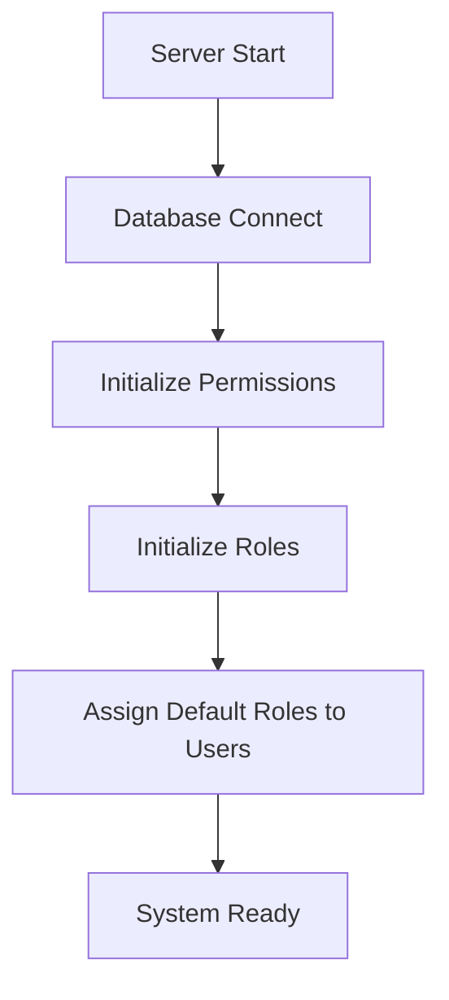
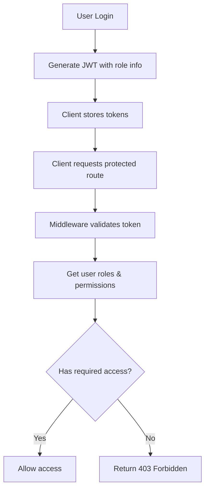
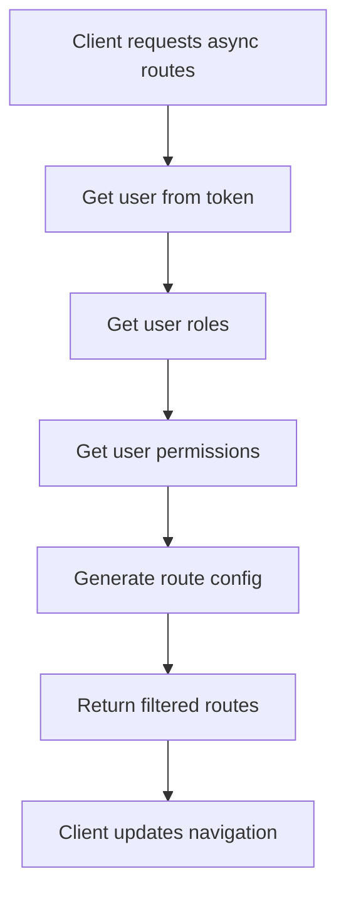

# Hệ Thống Phân Quyền Backend - MEGA-HOLDING-MANAGER

## Tổng Quan

Hệ thống phân quyền được thiết kế để tương thích hoàn toàn với client React, hỗ trợ cả **Role-based Access Control (RBAC)** và **Permission-based Access Control (PBAC)**.

## Kiến Trúc Hệ Thống

### 1. Models

#### **User Model** (`/models/user/user.model.ts`)

```typescript
{
  role: Number,           // Primary role (UserRole enum)
  roles: [ObjectId],      // Additional roles (references to Role collection)
  // ... other fields
}
```

#### **Role Model** (`/models/role/role.model.ts`)

```typescript
{
  name: String,           // "Administrator", "Common User"
  code: String,           // "admin", "common", "manager"
  description: String,
  permissions: [ObjectId], // Array of Permission references
  status: Number          // 1: Active, 2: Inactive
}
```

#### **Permission Model** (`/models/permission/permission.model.ts`)

```typescript
{
  code: String,           // "permission:button:get", "permission:button:add"
  name: String,           // "View/Get Data", "Add/Create Data"
  description: String,
  module: String,         // "system", "user", "department"
  action: String          // "get", "add", "update", "delete"
}
```

### 2. Enums & Constants

#### **User Roles** (`/constants/enum/user/user.enum.ts`)

```typescript
export enum UserRole {
  ADMIN = 1,
  MANAGER = 2,
  USER = 3
}

export const UserRoleString: Record<UserRole, string> = {
  [UserRole.ADMIN]: 'admin',
  [UserRole.MANAGER]: 'manager',
  [UserRole.USER]: 'common'
}

export const PermissionCodes = {
  GET: 'permission:button:get',
  ADD: 'permission:button:add',
  UPDATE: 'permission:button:update',
  DELETE: 'permission:button:delete'
}
```

### 3. Services

#### **Permission Service** (`/services/permission/permission.service.ts`)

- `initializePermissions()`: Khởi tạo permissions mặc định
- `initializeRoles()`: Khởi tạo roles với permissions
- `getUserPermissions(roleIds)`: Lấy danh sách permissions của user
- `hasPermission(roleIds, permissionCode)`: Kiểm tra quyền cụ thể
- `getRoleByCode(code)`: Lấy role theo code

### 4. Middleware Authorization

#### **Authorization Middleware** (`/middlewares/auth/authorization.middleware.ts`)

##### `requireRoles(requiredRoles: string[])`

Kiểm tra user có một trong các roles yêu cầu:

```typescript
// Sử dụng
app.get('/admin-only', requireRoles(['admin']), handler)
app.get('/admin-or-manager', requireRoles(['admin', 'manager']), handler)
```

##### `requirePermissions(requiredPermissions: string[])`

Kiểm tra user có tất cả permissions yêu cầu:

```typescript
// Sử dụng
app.post('/create-user', requirePermissions(['permission:button:add']), handler)
```

##### Shortcuts

```typescript
export const adminOnly = requireRoles(['admin'])
export const adminOrManager = requireRoles(['admin', 'manager'])
```

### 5. API Endpoints

#### **Get Async Routes** (`GET /user/get-async-routes`)

Trả về cấu hình routes động dựa trên roles và permissions của user:

```typescript
// Response format
{
  message: "Get async routes successfully",
  result: [
    {
      path: "/system",
      handle: {
        icon: "SettingOutlined",
        title: "common.menu.system",
        roles: ["admin"]
      },
      children: [
        {
          path: "/system/user",
          handle: {
            icon: "UserOutlined",
            title: "common.menu.user",
            roles: ["admin"],
            permissions: [
              "permission:button:add",
              "permission:button:update",
              "permission:button:delete"
            ]
          }
        }
      ]
    }
  ]
}
```

## Flow Hoạt Động

### 1. Khởi Tạo Hệ Thống



### 2. Authentication & Authorization Flow



### 3. Dynamic Route Loading



## Cách Sử Dụng

### 1. Bảo Vệ Route với Roles

```typescript
import { adminOnly, requireRoles } from '~/middlewares/auth/authorization.middleware'

// Chỉ admin
router.get('/admin-dashboard', adminOnly, handler)

// Admin hoặc Manager
router.get('/management', requireRoles(['admin', 'manager']), handler)
```

### 2. Bảo Vệ Route với Permissions

```typescript
import { requirePermissions } from '~/middlewares/auth/authorization.middleware'

// Cần quyền thêm mới
router.post('/users', requirePermissions(['permission:button:add']), handler)

// Cần nhiều quyền
router.put('/users/:id', requirePermissions(['permission:button:update', 'permission:button:get']), handler)
```

### 3. Kết Hợp Roles và Permissions

```typescript
// Phải là admin VÀ có quyền delete
router.delete('/users/:id', requireRoles(['admin']), requirePermissions(['permission:button:delete']), handler)
```

## Tương Thích với Client

### 1. User Store

Client nhận được user info với `roles` array:

```typescript
{
  _id: "...",
  email: "admin@example.com",
  name: "Admin User",
  roles: ["admin"], // Được transform từ backend
  // ... other fields
}
```

### 2. Route Configuration

Client nhận được route config với đầy đủ thông tin phân quyền:

```typescript
{
  path: "/system/user",
  handle: {
    roles: ["admin"],           // Cho useAccess.hasAccessByRoles()
    permissions: [              // Cho useAccess.hasAccessByCodes()
      "permission:button:add",
      "permission:button:update",
      "permission:button:delete"
    ]
  }
}
```

### 3. AuthGuard Compatibility

- Backend trả về roles dưới dạng string array
- Route permissions được định nghĩa chính xác như client expect
- Async routes API cung cấp cấu hình động cho navigation

## Mở Rộng Hệ Thống

### 1. Thêm Permission Mới

```typescript
// Trong PermissionService.initializePermissions()
{
  code: 'permission:button:export',
  name: 'Export Data',
  description: 'Permission to export data',
  module: 'system',
  action: 'export'
}
```

### 2. Thêm Role Mới

```typescript
// Trong PermissionService.initializeRoles()
{
  name: 'Department Manager',
  code: 'dept_manager',
  description: 'Department level management access',
  permissions: [/* specific permission IDs */]
}
```

### 3. Custom Authorization Logic

```typescript
// Tạo middleware tùy chỉnh
export const departmentManagerOnly = async (req, res, next) => {
  const user = await User.findById(req.decoded_authorization.user_id)
  if (user.department && user.role === UserRole.MANAGER) {
    next()
  } else {
    res.status(403).json({ message: 'Department manager access required' })
  }
}
```

## Lưu Ý Quan Trọng

1. **Database Initialization**: Permissions và roles được tự động khởi tạo khi server start
2. **Backward Compatibility**: Hệ thống vẫn hỗ trợ primary role field để tương thích ngược
3. **Performance**: Sử dụng populate để tối ưu queries
4. **Security**: Middleware kiểm tra cả token validity và user permissions
5. **Flexibility**: Có thể kết hợp roles và permissions cho logic phức tạp

## Testing

Để test hệ thống:

1. Tạo users với different roles
2. Test các protected endpoints
3. Verify async routes response
4. Check client integration với AuthGuard
